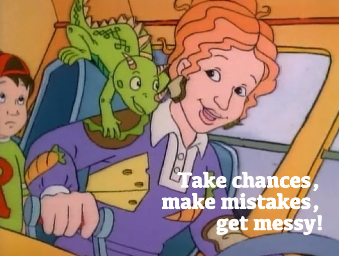

# Drawing with Code without a Computer

We're going to create our first generative art by drawing with code without a computer using our low-tech generative art kits.

Open your envelopes and:

    1. Using the pencil, draw a triangle anywhere on the page
    2. Somewhere in the remaining space, draw a circle
    3. Finally, in the remaining space, draw a square
    4. Colour in one of the shapes using the red crayon
    5. Colour in one of the remaining shapes using the yellow crayon
    6. Colour in the last shape using the blue crayon
