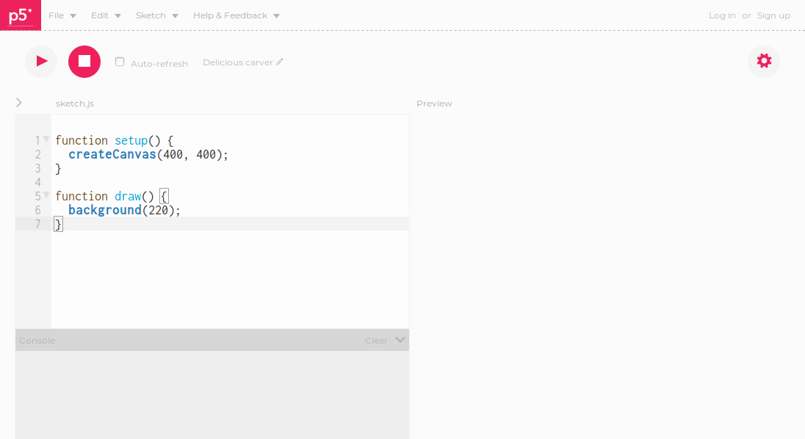

# The p5.js web editor

We can create sketches using p5.js in two ways:

- by downloading and installing the libraries from https://p5js.org/download/
- by using the p5.js web editor at https://editor.p5js.org/

For this workshop, we are going to use the web editor:

## Creating an account

If you want to save your sketches or share your sketches via the p5.js editor website, you will have to create an account.

- click on the Sign Up button at the top right corner of the screen
- the only information you will be asked to provide is your email address and a password
- if you don't want to sign up, you can still use the editor but won't be able to save your work in progress or the final sketch

## What are the different parts of the editor for?

Editor pane
  - used to type in the p5.js commands that will make up our sketch
  - you can find a full reference to the p5.js commands at https://p5js.org/reference/

Start and Stop buttons
  - used to start and stop our sketch
  - they are located just above the Editor pane
  - try them and see what happens

Preview pane
  - shows the result of playing the sketch

Console pane
- if the sketch can't be played, messages about possible reasons why are shown in the Console pane.
- we can use the console.log() command in our sketches to print status information to the Console pane to help us fix programming problems.
- in the Editor pane, type in the following statement then press Play:

      console.log('Hello, world!');

## The Editor pane

- The Edit pane is pre-filled with a skeleton of a p5.js sketch.
- All of our p5.js sketches will have at least two function definitions:
  - setup()
  - draw()

## setup()

The skeleton setup() creates a canvas to draw on:

    createCanvas(400, 400);

- the first 400 represents the width of the canvas in pixels
- the second 400 represents the height of the canvas in pixels
- try changing them and see what happens (remember to press Stop then Start if you don't have Auto-refresh checked)

## draw()

The skeleton draw() function definition draws a background on the canvas:

    background(220);

- 220 represents a shade of grey
- try changing it and see what happens
