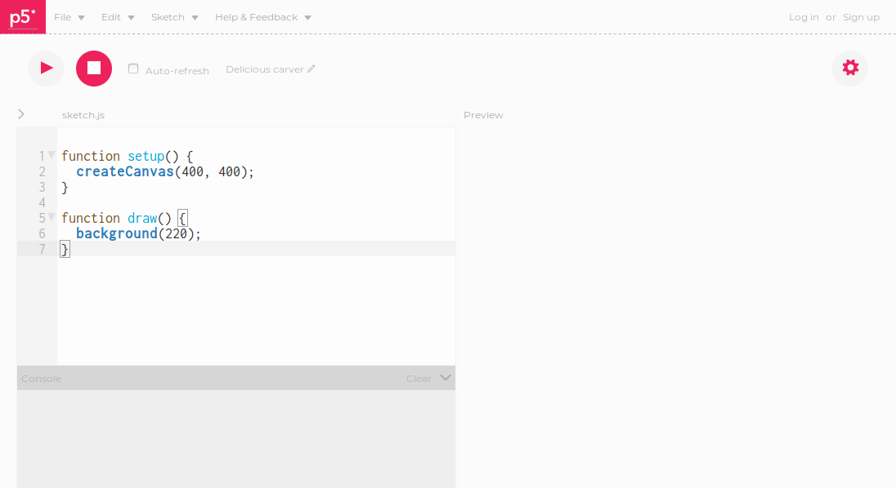

# The p5.js web editor

There are two ways to create sketches using p5.js:

- by downloading and installing the libraries
- by using the p5.js web editor

For this workshop, we are going to use the web editor:

- we won't have to spend time setting it up on everyone's computer
- we'll all be working with the same user interface as we create our sketches

If you continue to creat p5 sketches, you'll probably want to download the libraries
and use a more full featured editor.
You can find instructions on downloading and using the libraries here:

## Creating an account

Go to https://editor.p5js.org/

1. Get started by going to http://editor.p5js.org/. You should see the p5.js editor:

2. Click on Sign up to create an account so you can
save your sketches and share them with other people.
You'll have to provide your email address and a create a password.
If you don't want to sign up, you can still create sketches but you won't be able to save them.

3. Make sure the Auto-refresh check-box (next to the Stop button) is checked.

4. Press the Play button to make sure everything is working.
A gray rectangle should appear to the right of the editing pane.

## What are the different parts of the editor for?

We type commands into the Editor pane and then play them.
The result of playing the commands is shown in the Preview pane.
If the commands can't be played, messages about possible reasons why are shown in the Console pane.

### Menu bar

### Play bar

### Side pane (hidden by default)

### Edit pane

The Edit pane is pre-filled with the functions of a skeleton of a p5.js sketch.
All of our p5.js sketches will have at least two functions: setup() and draw().

#### setup

    createCanvas(400, 400);

- the first 400 represents the width of the canvas in pixels
- the second 400 represents the height of the canvas in pixels
- try changing them and see what happens

#### draw

    background(220);

### Preview pane

### Console pane

## What are the p5.js commands?

A full reference to the p5.js commands can be found at https://p5js.org/reference/. They let us do things like
