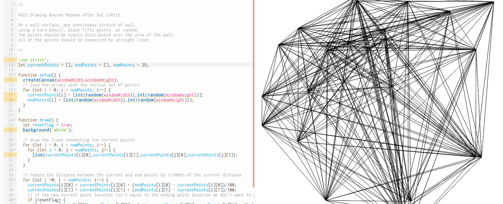

# Drawing with Code using p5.js

p5.js is a JavaScript library that starts with the original goal of Processing to make coding accessible for artists, designers, educators, and beginners, and reinterprets this for today's web. p5.js sketches will run in most browsers making it easier than ever to share your art over the web without the need for plugins or other additional software. p5.js has addon libraries that make it easy to interact with other HTML5 objects, including text, input, video, webcam, and sound.

In this workshop, participants will be introduced to generative art and the fundamentals of p5.js, a programming language developed for artists to simplify drawing with code. Participants will learn how to use the p5.js web editor to create sketches using built-in and user-defined shapes, animate the shapes to create dynamic sketches, introduce randomness to create sketches that are different each time they are run, and share the sketches over the web.

View a live demo <a href="https://adamherst.art/wall_drawing_boston_museum_after_sol_lewitt/">here</a>.
